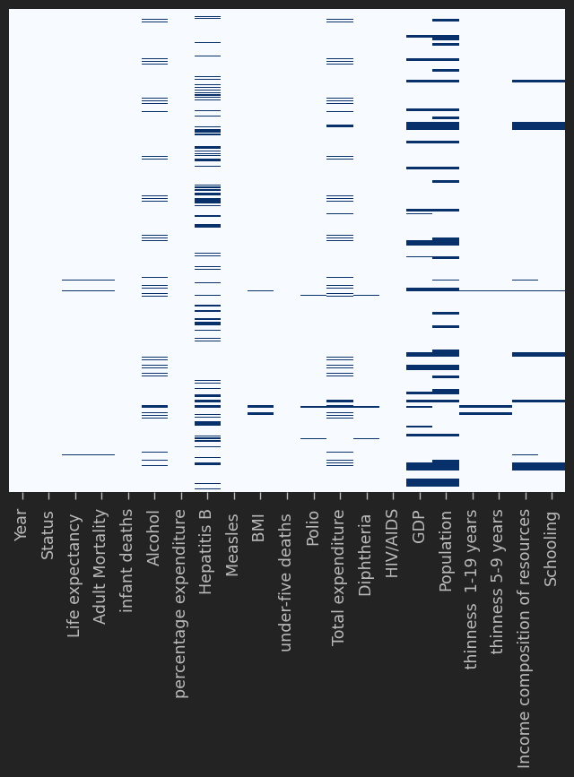
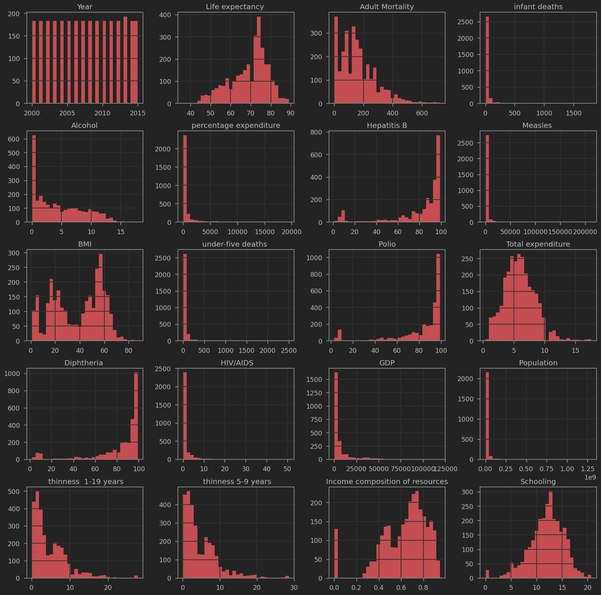
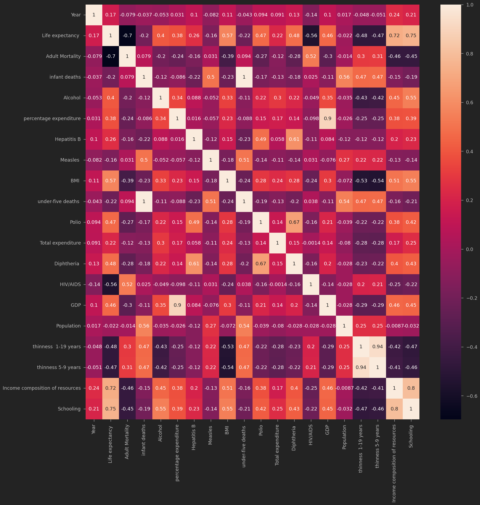

# Life Expectancy Prediction Using XGBoost Regression

**Predicting life expectancy from global health, demographic, and socioeconomic indicators using machine learning.**

## Overview

Life expectancy is influenced by a range of public health, demographic, and socioeconomic factors. Understanding the relationships among these variables can help illustrate how machine learning can be applied to population-level health data.

This project explores a global life expectancy dataset and develops an XGBoost regression model to estimate life expectancy using health and socioeconomic indicators.

The workflow includes exploratory data analysis, missing-value handling, categorical feature encoding, regression modeling, and evaluation of different tree-depth configurations.

## Dataset

The project uses `Life_Expectancy_Data.csv`, containing **2,938 observations** across the years **2000–2015**.

The dataset includes 21 columns covering life expectancy and several categories of explanatory variables.

| Category | Example variables |
|---|---|
| Health outcomes | Life expectancy, adult mortality, infant deaths |
| Disease indicators | HIV/AIDS, measles |
| Immunization | Hepatitis B, polio, diphtheria |
| Health and lifestyle | BMI, alcohol consumption |
| Economic indicators | GDP, health expenditure |
| Demographic indicators | Population, development status |
| Education and resources | Schooling, income composition of resources |

**Prediction target:** Life expectancy, measured in years.

## Exploratory Data Analysis

### Missing-Value Analysis

A missing-value heatmap was used to identify incomplete observations.

Several variables contained missing values, including population, GDP, Hepatitis B immunization, alcohol consumption, and schooling.

This analysis helped identify the preprocessing required before training the regression model.

### Feature Distributions

Histograms were generated to examine the distributions of numerical variables.

These visualizations provided an overview of the dataset's health, demographic, and socioeconomic measurements.

### Correlation Analysis

A correlation matrix was generated to examine relationships among numerical variables.

This step supported exploratory analysis of the associations between life expectancy and the other indicators.

Correlation does not establish causation, and the notebook does not include a separate feature-importance analysis.

## Data Preprocessing

The dataset was prepared for machine learning through the following steps:

- Converted the categorical development-status variable into numerical features using one-hot encoding.
- Identified missing values across numerical columns.
- Replaced missing values using column means.
- Separated life expectancy as the prediction target.
- Converted the feature and target arrays to `float32`.
- Divided the dataset into 70% training data and 30% testing data.

The original notebook performs mean imputation before the train/test split. This is appropriate to document as part of the exercise, although a production-oriented workflow should fit imputation only on the training data to avoid information leakage.

## XGBoost Regression Modeling

The project uses **XGBoost (Extreme Gradient Boosting)**, an ensemble learning method that combines decision trees through gradient boosting.

Two model configurations were evaluated to explore how tree depth affects predictive performance.

### Model 1: Deep XGBoost Regressor

The first model was configured with:

| Hyperparameter | Value |
|---|---|
| Objective | `reg:squarederror` |
| Learning rate | 0.1 |
| Maximum depth | 30 |
| Number of estimators | 100 |

The model was trained using the training subset and evaluated on the test subset.

### Model 2: Shallow XGBoost Regressor

A second model was trained using the same learning rate and number of estimators, but with a maximum depth of 2.

This provided a comparison between deeper and shallower decision-tree configurations.

## Model Evaluation

The models were evaluated using:

- Mean Squared Error (MSE)
- Root Mean Squared Error (RMSE)
- Mean Absolute Error (MAE)
- Coefficient of Determination (R²)
- Adjusted R²

### Results

| Evaluation metric | XGBoost (depth 30) | XGBoost (depth 2) |
|---|---:|---:|
| RMSE (years) | 1.923 | 2.561 |
| MSE | 3.697 | 6.560 |
| MAE (years) | 1.214 | 1.921 |
| R² | 0.9567 | 0.9231 |
| Adjusted R² | 0.9556 | 0.9212 |

The deeper model achieved a higher test R² and lower prediction errors in the recorded experiment.

However, these results come from a single train/test split. Additional validation would be necessary to establish how reliably the models generalize to unseen countries or future years.

## Key Findings

- XGBoost was able to model relationships between life expectancy and the available health and socioeconomic indicators.
- The deeper model achieved stronger performance than the shallower model in the recorded test.
- Reducing maximum tree depth from 30 to 2 increased prediction errors in this experiment.
- Missing-value handling and categorical encoding were important steps in preparing the dataset.
- Model performance should be interpreted alongside validation design and potential data leakage.

## Technologies Used

- **Python** — Data analysis and model development
- **Pandas & NumPy** — Data preparation and numerical operations
- **Matplotlib & Seaborn** — Exploratory data visualization
- **XGBoost** — Gradient-boosted regression modeling
- **scikit-learn** — Train/test splitting and regression evaluation
- **Jupyter Notebook** — Interactive development

## Skills Demonstrated

- Exploratory data analysis
- Missing-value identification and imputation
- Categorical feature encoding
- Regression modeling
- Gradient boosting
- Hyperparameter experimentation
- Train/test evaluation
- RMSE, MSE, MAE, and R² interpretation
- Model comparison

## Project Context and Limitations

This project was completed as a hands-on machine learning exercise.

The reported performance is based on a random train/test split of country-year observations. The notebook does not establish performance on entirely unseen countries or future years.

Additionally, mean imputation was performed before splitting the data, which can introduce information leakage. A more rigorous evaluation would use training-only preprocessing and country-aware or time-aware validation.

The models are intended to demonstrate machine learning techniques, not to provide official population health forecasts.
